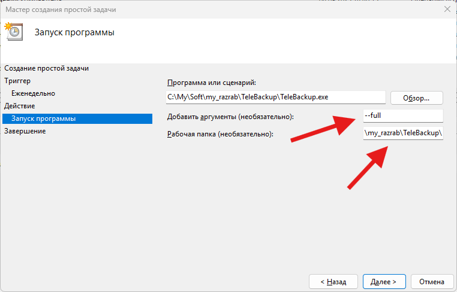

# TeleBackup 1.1

**Резервное копирование с шифрованием AES-256 и отправкой бэкапов в Telegram**

TeleBackup создаёт резервные копии файлов и папок, шифрует их AES-256 и может автоматически отправлять в Telegram. Поддерживает "умный" режим бэкапа, когда архивируются только изменённые или новые файлы. <br><br>
Telegram можно использовать, как личное облако для хранения файлов и резервных копий. Для этого достаточно создать приватный канал и пользоваться им, как облаком для личных нужд. Программа TeleBackup позволит автоматизировать процесс создания бэкапов и загрузки в Telegram.


[Скачать релиз](https://github.com/artemsoft2025/TeleBackup/releases)

---

## Особенности

- Полное резервное копирование файлов и папок
- Шифрование архивов AES-256
- Отправка архивов в Telegram (поддержка разделения на части)
- "Умный" бэкап: архивируются только новые или изменённые файлы
- Локальное хранение с очисткой по возрасту файлов
- Настраиваемое исключение файлов по маскам (`*.tmp`, `*.log` и др.)

---

## Как настроить и пользоваться

Для работы необходимо:
- Telegram бот с правами администратора в вашем канале
- Файл TeleBackup.exe в текущей папке
- Настроенный config.yaml файл

Порядок действий:
- Создайте свой Telegram канал для хранения резервных копий
- Создайте бота для загрузки бэкапов с компьютера на свой канал
- Настройте файл конфигурации config.yaml 
- Запустите программу `TeleBackup.exe --full` для создания архива с бэкапом и загрузкой его в телеграм канал. Для последующего простого использования достаточно этой же команды.
- Автоматизируйте процесс создания резервных копий с помощью Планировщика задач Windows. В настройках Задания Рабочую папку нужно указать обязательно!

---

## Простой пример

**Создаю канал в Telegram.** Можно создать приватный или публичный. Для личных бэкапов логично создать приватный канал:
1. Telegram → Нажмите на три линии → "Создать канал"
2. Название канала: My Backups (или любое другое)
3. Тип канала: Приватный (только по ссылке)
4. Настройки → Управление каналом → Администраторы (сюда пропишем нашего бота)

**Создаю бота:**
1. Найти @BotFather в поиске Telegram
2. Отправить команды:
```cmd
/newbot
MyBackupBot  # имя бота
MyBackupStorageBot  # username бота (должен заканчиваться на Bot)
```
3. Скопировать токен вида: 1234567890:ABCDEFGHIJKLMNOPQRSTUVWXYZ
4. Зайти в бота и нажать /start

Возвращаюсь в настройки канала:
1. В канале → Управление каналом → Администраторы
2. Добавить администратора → Введите username бота (@MyBackupStorageBot)
3. Права: Отправка сообщений - да, Все остальное - нет.

**Настройка программы TeleBackup:**<br>
Распаковываю архив TeleBackup. Настраиваю конфиг config.yaml с помощью обычного Блокнота, указать токен, ID канала, папки для бэкапа - этого достаточно для начала.


Как получить ID приватного канала: в папке программы есть две дополнительные утилиты для этой цели: `chat_id.exe` и `get_chat_id_gui.exe` 
<br><br>
Осуществляю первый запуск программы: `TeleBackup.exe --full`

<br><br>

В папке программы создается каталог `backups`, куда сохраняется архив с файлами. Потом он загружается в телеграм канал. <br>
Если полученный архив будет более 48 МБ, то он загрузится частями по 48 МБ.<br>
Теперь нужно автоматизировать процесс запуска утилиты с параметром `--full` с помощью Планировщика задач Windows. Рабочую папку нужно указать обязательно при создании Задания!



После создания Задания щелкните по нему правой кнопкой мыши, выберите "Выполнить" для проверки.

Теперь резервное копирование настроено и работает!

---

## Рекомендации и мысли

- Для работы программы нужны два файла: `TeleBackup.exe` и `config.yaml` , остальные файлы из дистрибутива можно удалить
- Если что-то заглючило, то удалите файл `backup_state.json` 
- Утилита `get_chat_id_gui.exe` не только помогает найти ID приватного канала, но и является графическим редактором `config.yaml` для тех, кому не нравится настройка руками
- Пароль к бэкапам и токен хранятся в `config.yaml` в открытом виде, поэтому используйте программу TeleBackup из папки вашего профиля Windows, чтобы другие пользователи не имели доступа к файлу с конфигом. 
- Пароль для бэкапа должен быть обязательно записан. Если он хранится только на диске компьютера с которого сохраняются бэкапы, то при его поломке бэкапы-то будут (в Телеграме), только вы их никогда не откроете, т.к. пароль вы забудете с большой долей вероятности.
- Наверняка у вас есть папка с семейными фото и видео, объемом, допустим 150 ГБ. Или какие-то архивные документы, и прочие файлы. Которые не меняются, но их важно сохранить. Залейте в созданный приватный канал Telegram их резервную копию вручную, т.к. при загрузке вручную у Telegram лимит на размер одного файла - 2 ГБ, а при использовании ботов - 50 МБ. Например, с помощью WinRar создайте архив с такими настройками: без сжатия; разбить архив на файлы по 1,9 ГБ. После архивации в Проводнике выделите все файлы этого rar-архива и перетащите в окно Telegram в ваш приватный канал. Загрузка займет много времени, но зато у вас будет резервная копия, доступ к которой сможете получить везде через Telegram.

## Запуск TeleBackup с помощью Задания Windows без отображения консольного окна

Если запуск утилиты TeleBackup через Задания Windows должен осуществляться без консольного окна, то в ее папке создайте vbs скрипт:
```cmd
Set WshShell = CreateObject("WScript.Shell")
' Получаем путь к папке, где находится скрипт
strPath = Left(WScript.ScriptFullName, InStrRev(WScript.ScriptFullName, "\"))
' Меняем текущую директорию на путь к скрипту
WshShell.CurrentDirectory = strPath
' Запускаем программу скрыто
WshShell.Run "TeleBackup.exe --full", 0, False
Set WshShell = Nothing
```
В Задании Windows укажите запуск программы:
`wscript.exe`
Аргументы:
`"C:\путь\к\скрипт.vbs"`
При использовании скрипта указывать Рабочую папку не обязательно.

## Связь

О выявленных ошибках и предложения пишите:
- Telegram: https://t.me/avhelpnew
- artemsoft[@]yahoo.com
